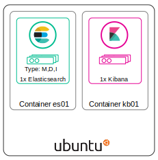
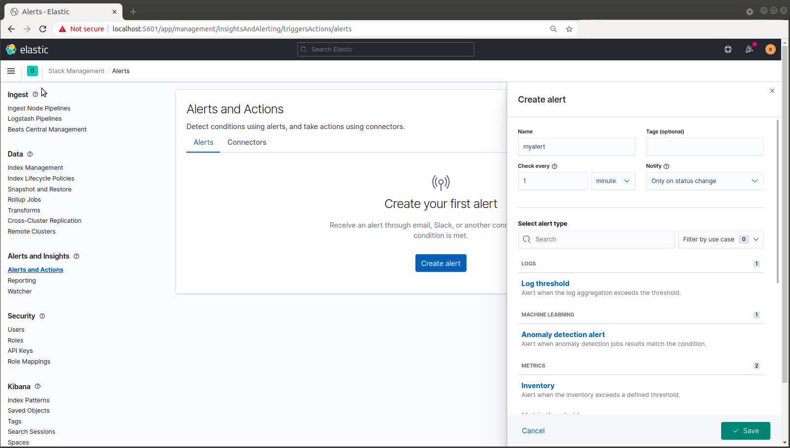

# stack-015 / Basic Architecture

This recipe contains an elastic stack consisting of 1x elasticsearch and 1x kibana node. elastic-stax-015 has the trial license 
and the basic security features enabled. So all license based features are activated (Machine Learning, Watcher etc ...) by
default. In addition ssl encryption is activated for Kibana so that the 'Alerting' feature is also enabled.

Please give us a [GitHub Star](https://github.com/schneidermatix/elastic-stax/stargazers)
if you like the project. Thank you in advance!

  

###### PREREQUISITES
---
For running the elastic-stax recipes(s) you need the following software components on your host system

Name           | Reference    
-------------- | --------------- 
ubuntu         | >= 18.04.5 LTS (Bionic Beaver)
docker         | [https://docs.docker.com/engine/reference/run/](https://docs.docker.com/engine/reference/run/)
docker-compose | [https://docs.docker.com/compose/reference/overview/](https://docs.docker.com/compose/reference/overview/)

SETUP
---

01. Clone the elastic-stax repo ( => if it's already done - skip this point!)

        $ cd ~
        $ mkdir workspace
        $ cd workspace
        $ git clone https://github.com/schneidermatix/elastic-stax.git

02. Initial setup of your environment ( => if it's already done - skip this point!)

        $ cd elastic-stax
        $ source ./.xrc
        $ x_setup

    **NOTE:** x_setup modifies Kernel parameter and reboots your host system after 30 seconds\
    due to the modifications of the kernel parameter.

03. a) Choose the use cases elastic-stax-015 and generate the ssl-certificate which is needed for running\
   Kibana in a secure mode so that the 'Alerting' can be enabled.

        $ cd ./stack-015
 
    b) Generate the ssl-cert & ssl-key 

        $ docker-compose -f create-certs.yml run --rm create_certs

    c) Start the containers by running the docker-compose command

        $ docker-compose up -d 

    **NOTE:** The '.xrc' file contains some short-hand functions for an easier handling. So you\
    can run the 'x_up' command for starting the containers.

        $ source ./.xrc
        $ x_up

    A list of all 'x_*' short-hand commands you can get by running ...

        $ x_ls

04. Use Kibana for further actions

        Login Credentials:

        User: elastic
        Password: changeme

        https://localhost:5601/

    

05. Use the Elasticsearch REST-API via curl

        $ curl -u elastic:changeme -k -XGET https://localhost:9200

Stop and Start the elastic stack
---

06. Stop the docker containers

        $ docker-compose stop

07. Start the docker containers

        $ docker-compose start 

Remove the entire stack
---

07. Remove the docker containers

        $ docker-compose down -v

    **NOTE:** when you run 'docker-compose down -v' you'll loose all your data too.

Contributing
---
If you find some bugs or have any requests/suggestions don't hesitate to open an issue or make a pull request.
